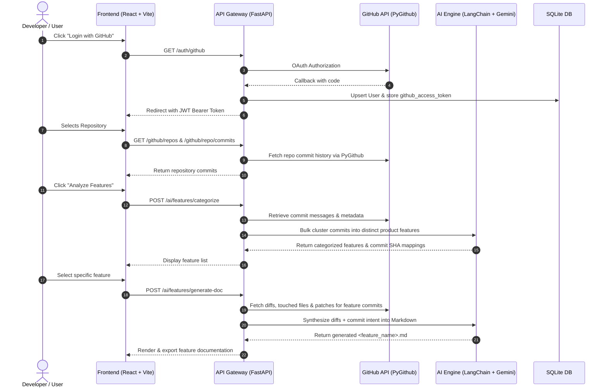
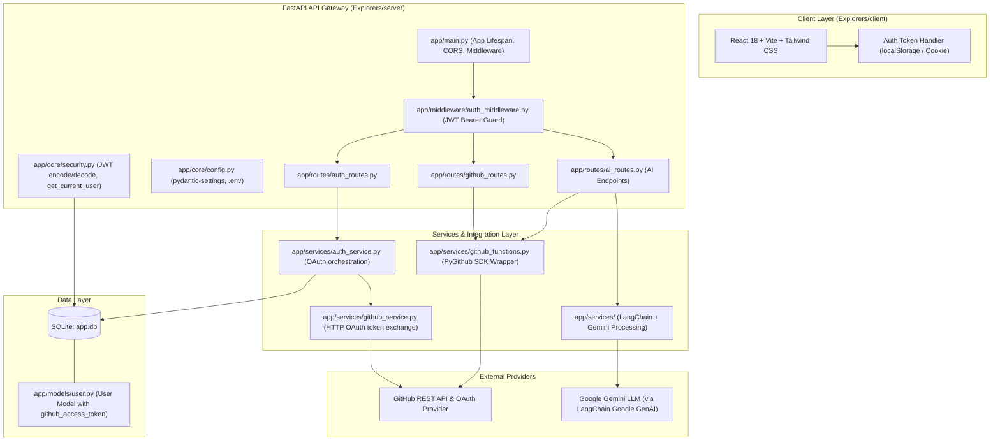
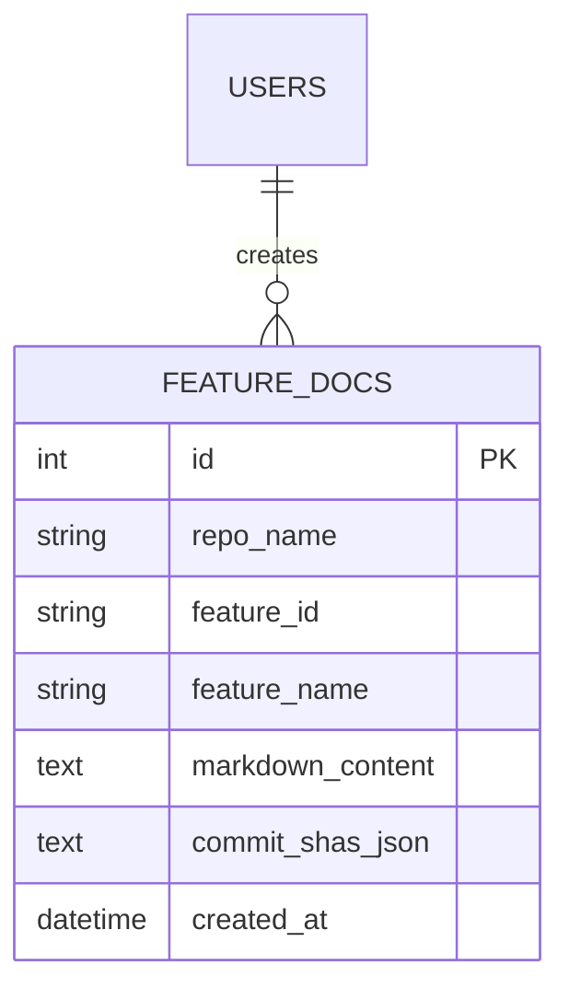

# Commitology: AI Developer Architecture & Implementation Guide

> **Target Audience:** AI/ML Engineers & Backend Developers building the AI-powered commit categorization and feature-wise documentation generation engine for **Commitology**.

---

## 1. Executive Summary & Project Vision

### 1.1 The Core Mission
Modern software engineering teams write descriptive, high-quality commit messages explaining their architectural pivots, implementation logic, schema migrations, and bug fixes. However, this knowledge is locked away in linear, fragmented Git commit logs.

**Commitology** automates the transformation of raw GitHub repository activity into polished, structured, **feature-wise engineering documentation** (`<feature_name>.md`).

### 1.2 Core Workflow
1. **GitHub Authentication**: The developer logs in via GitHub OAuth. Commitology stores the OAuth access token in the database, allowing PyGithub to make authenticated API requests with high rate limits (5,000 requests/hr).
2. **Repository & Commit Ingestion**: The user chooses a repository. PyGithub fetches the recent commit history in bulk (commit SHAs, messages, authors, dates).
3. **Stage 1 (Feature Categorization & Clustering)**: All commit messages are passed together to Gemini LLM (`gemini-3.6-flash` or `gemini-1.5-flash`). The AI clusters related commits into cohesive product features (e.g. *OAuth Authentication*, *Database Persistence*, *Data Ingestion Service*).
4. **Stage 2 (Feature Documentation Synthesis - `<feature_name>.md`)**: When the user selects a specific feature, the backend extracts the full diff context (impacted files, patches, commit descriptions) for only those commits belonging to that feature. The AI synthesizes this context into a comprehensive, publication-grade `<feature_name>.md`.

### 1.3 User Journey Sequence Diagram


---

## 2. System Architecture & Component Landscape

The system is organized around a FastAPI backend serving as an API Gateway, communicating with GitHub using PyGithub and orchestrating Google Gemini through LangChain.



---

## 3. Deep-Dive: Existing Codebase Analysis

### 3.1 Directory Structure
```
Explorers/server/
├── .env                              # Environment configurations (OAuth credentials, DB URL, JWT Secret)
├── app.db                            # SQLite database instance
├── pyproject.toml                    # UV / Pip Project dependencies
├── uv.lock                           # UV lockfile
├── README.md                         # Server README
│
├── aiservice/                        # AI Processing Module (Incubating Prototype)
│   └── doc.py                        # Initial single-file doc prototype using LangChain + Gemini
│
└── app/
    ├── main.py                       # FastAPI entrypoint, lifespan DB setup, CORS, routers
    ├── controllers/
    │   └── auth_controller.py        # GitHub OAuth login, callback, logout logic
    ├── core/
    │   ├── config.py                 # Pydantic BaseSettings loading .env
    │   └── security.py               # JWT token creation, decoding, get_current_user dependency
    ├── database/
    │   └── database.py               # SQLAlchemy engine, Base, SessionLocal, get_db dependency
    ├── middleware/
    │   └── auth_middleware.py        # Global HTTP Bearer token validation middleware
    ├── models/
    │   └── user.py                   # User SQLAlchemy model (stores github_access_token)
    ├── routes/
    │   ├── auth_routes.py            # /auth/github, /auth/github/callback, /auth/me, /auth/logout
    │   └── github_routes.py          # /github/repos, /github/repo/commits, /github/repo/contributors
    ├── schemas/
    │   ├── auth.py                   # Pydantic models: UserResponse, TokenResponse
    │   └── github_res.py             # Pydantic models: CommitResponse, ContributorsResponse, CommitByContributorResponse
    └── services/
        ├── auth_service.py           # User lookup/creation and OAuth token exchange
        ├── github_functions.py       # PyGithub operations (get_latest_repos, get_repo_commits, etc.)
        └── github_service.py         # Direct HTTP requests to GitHub OAuth & User APIs
```

---

### 3.2 Authentication & User Security Flow

The system authenticates users via GitHub OAuth 2.0 and issues an application-specific JWT. **Crucially, the GitHub personal/OAuth access token is persisted in the database**, allowing Commitology to make authenticated PyGithub requests with high GitHub API rate limits (5,000 requests/hr instead of 60 for unauthenticated requests).

#### 1. Configuration: [`app/core/config.py`](file:///c:/Users/bky84/OneDrive/Documents/Desktop/hacknex/Explorers/server/app/core/config.py)
```python
class Settings(BaseSettings):
    github_client_id: str = ""
    github_client_secret: str = ""
    github_redirect_url: str = ""
    jwt_secret: str = ""
    jwt_algorithm: str = "HS256"
    database_url: str = "sqlite:///./app.db"
    frontend_url: str = "http://localhost:5173"
    google_api_key: str = ""  # Used by LangChain Gemini integration
```
> [!NOTE]
> `google_api_key: str = ""` is configured in `Settings` so that `ChatGoogleGenerativeAI` can consume it from `.env`.

#### 2. User Model: [`app/models/user.py`](file:///c:/Users/bky84/OneDrive/Documents/Desktop/hacknex/Explorers/server/app/models/user.py)
The `User` model stores the GitHub identity and token:
```python
class User(Base):
    __tablename__ = "users"
    id: Mapped[int] = mapped_column(Integer, primary_key=True, index=True)
    github_id: Mapped[str] = mapped_column(String, unique=True, nullable=False)
    username: Mapped[str] = mapped_column(String, nullable=False)
    name: Mapped[str | None] = mapped_column(String, nullable=True)
    email: Mapped[str | None] = mapped_column(String, nullable=True)
    avatar_url: Mapped[str | None] = mapped_column(String, nullable=True)
    github_access_token: Mapped[str | None] = mapped_column(String, nullable=True)
```

#### 3. Token Resolution: [`app/core/security.py`](file:///c:/Users/bky84/OneDrive/Documents/Desktop/hacknex/Explorers/server/app/core/security.py)
Endpoints obtain the current logged-in user and their `github_access_token` by injecting:
```python
current_user: User = Depends(get_current_user)
token = current_user.github_access_token
```

#### 4. Route Protection: [`app/middleware/auth_middleware.py`](file:///c:/Users/bky84/OneDrive/Documents/Desktop/hacknex/Explorers/server/app/middleware/auth_middleware.py)
Intercepts all requests except `PUBLIC_ROUTES`:
```python
PUBLIC_ROUTES = {
    "/", "/docs", "/redoc", "/openapi.json",
    "/auth/github", "/auth/github/callback", "/auth/logout"
}
```
Any new AI routes (e.g., `/ai/*`) are automatically guarded by this middleware and require an `Authorization: Bearer <JWT>` header.

---

### 3.3 GitHub Data Ingestion: [`app/services/github_functions.py`](file:///c:/Users/bky84/OneDrive/Documents/Desktop/hacknex/Explorers/server/app/services/github_functions.py)

Existing functions utilize PyGithub (`from github import Github`):

1. **`get_latest_repos(token)`**:
   - Fetches repos sorted by `pushed` descending.
   - Returns a list of `repo.full_name` strings (e.g. `["octocat/Hello-World", "owner/repo"]`).
2. **`get_repo_commits(token, repo_name)`**:
   - Accesses `g.get_repo(repo_name).get_commits()`.
   - Returns a list of dictionaries: `sha`, `message`, `author`, `date` (ISO format).
3. **`get_commit_authors(token, repo_name, limit)`**:
   - Extracts unique contributors with username and avatar.
4. **`get_commits_by_contributer(token, repo_name, contributor)`**:
   - Filters commits by contributor login.

#### Routes Mapping in [`app/routes/github_routes.py`](file:///c:/Users/bky84/OneDrive/Documents/Desktop/hacknex/Explorers/server/app/routes/github_routes.py):
- `GET /github/repos` $\rightarrow$ Returns `list[str]`
- `GET /github/repo/commits?repo={owner/repo}` $\rightarrow$ Returns `list[CommitResponse]`
- `GET /github/repo/contributors?repo={owner/repo}` $\rightarrow$ Returns `list[ContributorsResponse]`
- `GET /github/repo/contributor/commits?repo={owner/repo}&contributor={username}` $\rightarrow$ Returns `list[CommitByContributorResponse]`

---

### 3.4 Seed AI Implementation: [`aiservice/doc.py`](file:///c:/Users/bky84/OneDrive/Documents/Desktop/hacknex/Explorers/server/aiservice/doc.py)

Currently exists as an isolated proof-of-concept:
```python
from langchain_google_genai import ChatGoogleGenerativeAI
from langchain_core.prompts import PromptTemplate
from dotenv import load_dotenv

load_dotenv()

def committodoc(commit_message, filename, file_content):
    llm = ChatGoogleGenerativeAI(model="gemini-3.5-flash", temperature=0.2)
    prompt_template = PromptTemplate(
        input_variables=["commit_message", "filename", "file_content"],
        template="you are a great documentation writer. I have the {commit_message}, {filename} and the {file_content} of the user. Write a detailed documentation what changes have been done in the file and what is the purpose of the changes.",
    )
    name_chain = prompt_template | llm
    res = name_chain.invoke({"commit_message": commit_message, "filename": filename, "file_content": file_content})
    return res
```

**Limitations of the current prototype:**
1. **Single-file scope**: Real software features span multiple commits and dozens of files.
2. **No categorization**: Does not cluster commit messages into feature domains.
3. **No diff awareness**: Passes raw `file_content` instead of commit diffs/patches, which easily overflows token limits on large repositories.
4. **Not connected to FastAPI**: Not integrated into the routes or schemas.

---

## 4. AI Engine Blueprint: The Two-Stage Processing Pipeline

To satisfy the project requirements, the AI developer must implement a **Two-Stage AI Pipeline**:
1. **Stage 1 (Categorization & Clustering)**: Ingest all commit messages for a repository and categorize them into semantic **Features**.
2. **Stage 2 (Documentation Synthesis)**: When a user selects a feature, fetch all associated commit diffs and synthesize a comprehensive `<feature_name>.md`.

```
Raw Commits from PyGithub
[sha, message, author, date]
            │
            ▼
┌───────────────────────────────────────────────┐
│ STAGE 1: Feature Categorization (LLM)         │
│ Analyzes all commit messages in bulk          │
│ Clusters into logical product features        │
└───────────────────────────────────────────────┘
            │
            ▼
Feature Catalog with Mapped Commit SHAs
{ feature_id, feature_name, summary, commit_shas }
            │
            ▼ (User selects a specific feature)
┌───────────────────────────────────────────────┐
│ DIFF HYDRATION (PyGithub)                     │
│ For mapped commit_shas:                       │
│ - Fetch touched files                         │
│ - Fetch file diffs (patches)                  │
│ - Filter noise (.lock, node_modules, min.js)  │
└───────────────────────────────────────────────┘
            │
            ▼
┌───────────────────────────────────────────────┐
│ STAGE 2: Markdown Synthesis (LLM)             │
│ Generates structured, production-grade        │
│ <feature_name>.md documentation               │
└───────────────────────────────────────────────┘
            │
            ▼
Generated <feature_name>.md (Rendered in UI & Exported)
```

---

## 5. Detailed Technical Specifications for AI Developers

### 5.1 Stage 1: Commit Clustering & Feature Categorization

#### The Challenge
Commit histories can range from 10 to 500+ commits. Commit messages usually explain intent (e.g. `feat(auth): integrate github oauth flow`, `fix(db): add missing foreign key index on users table`). Passing all commit messages at once enables the LLM to understand the repository-wide evolution and cluster commits into functional feature groups.

#### Implementation Strategy
1. **Fetch Commit Corpus**:
   - Fetch the latest $N$ commits (e.g., default 50–100 for interactive speed, or paginated chunks).
2. **Commit Message Normalization**:
   - Extract `sha` (shortened to 7 chars), `message` (summary + description), `date`, and `author`.
3. **Structured Output LLM Prompt**:
   - Use `gemini-3.6-flash` with structured Pydantic output.
   - Instruct the LLM to cluster the commits into distinct, cohesive features.

#### Desired Pydantic Schema:
```python
from pydantic import BaseModel, Field
from typing import List

class FeatureCluster(BaseModel):
    feature_id: str = Field(description="Unique kebab-case slug, e.g., 'github-oauth-authentication'")
    feature_name: str = Field(description="Human readable name, e.g., 'GitHub OAuth & User Authentication'")
    summary: str = Field(description="Concise 1-2 sentence description of what this feature encompasses.")
    category: str = Field(description="Domain tag: Authentication, Database, Frontend UI, AI Pipeline, API, Infrastructure")
    commit_shas: List[str] = Field(description="List of commit SHAs belonging to this feature")
    primary_files_hint: List[str] = Field(default=[], description="Key files or directories inferred from commit messages")

class FeatureCategorizationResponse(BaseModel):
    repository: str
    total_commits_analyzed: int
    features: List[FeatureCluster]
```

#### Prompt Design for Categorization:
```text
You are a Principal Software Architect analyzing a Git repository's commit history.
Your task is to analyze the following commit messages and group all commits into logical, high-level features.

Guidelines:
1. Every commit must belong to at most one most appropriate feature cluster.
2. Cluster by architectural and functional cohesiveness (e.g., 'OAuth Authentication', 'Database Migration & Persistence', 'Data Ingestion Service', 'Real-Time Notifications').
3. Ignore pure maintenance noise (e.g., merge commits, bump version) by placing them in a 'Chore & Maintenance' group or merging them into related features.
4. Output must strictly conform to the provided JSON schema.

Repository: {repo_name}
Commits:
{commit_list_json}
```

---

### 5.2 PyGithub Code & Diff Hydration

Once a feature is selected by the user, the backend must retrieve the actual code changes for the commits mapped to that feature.

#### Enhancing PyGithub Service:
```python
# app/services/github_functions.py

def get_feature_diff_context(token: str, repo_name: str, commit_shas: list[str], max_patch_chars: int = 4000) -> dict:
    """
    Given a list of commit SHAs, extracts changed files, commit messages, and diff patches.
    Excludes binary files and large lockfiles to conserve token budget.
    """
    g = Github(token)
    repo = g.get_repo(repo_name)
    
    IGNORE_EXTENSIONS = {'.lock', '.png', '.jpg', '.jpeg', '.gif', '.svg', '.pyc', '.exe', '.pdf', '.min.js', '.map'}
    IGNORE_FILES = {'uv.lock', 'package-lock.json', 'pnpm-lock.yaml', 'yarn.lock', 'app.db'}

    files_impacted = {}
    commit_details = []

    for sha in commit_shas:
        commit = repo.get_commit(sha)
        commit_details.append({
            "sha": commit.sha[:7],
            "message": commit.commit.message,
            "author": commit.commit.author.name,
            "date": commit.commit.author.date.isoformat()
        })

        for file in commit.files:
            filename = file.filename
            
            # Filter noise
            if any(filename.endswith(ext) for ext in IGNORE_EXTENSIONS) or filename in IGNORE_FILES:
                continue

            if filename not in files_impacted:
                files_impacted[filename] = {
                    "filename": filename,
                    "status": file.status, # added, modified, removed
                    "additions": file.additions,
                    "deletions": file.deletions,
                    "patch": (file.patch[:max_patch_chars] + "\n...[truncated]") if file.patch and len(file.patch) > max_patch_chars else (file.patch or "")
                }
            else:
                # Accumulate additions/deletions
                files_impacted[filename]["additions"] += file.additions
                files_impacted[filename]["deletions"] += file.deletions
                if file.patch:
                    files_impacted[filename]["patch"] += f"\n\n--- Commit {commit.sha[:7]} Patch ---\n" + file.patch[:max_patch_chars]

    return {
        "commits": commit_details,
        "files": list(files_impacted.values())
    }
```

---

### 5.3 Stage 2: `<feature_name>.md` Synthesis

#### Prompt Engineering for Feature Documentation
The prompt requires structured, professional markdown conforming to standard software engineering documentation.

#### Prompt Template:
```text
You are an expert Staff Technical Writer and Senior Software Engineer.
Your task is to produce a definitive, highly detailed technical specification and documentation file titled `{feature_name}.md`.

You are provided with:
1. Feature Name: {feature_name}
2. Feature Summary: {feature_summary}
3. Commits Included: {commits_json}
4. Files Modified & Diffs: {files_diff_json}

The generated document MUST strictly follow this Markdown structure:

# Feature Documentation: {feature_name}

## 1. Executive Summary & Purpose
Explain what this feature is, why it was introduced, what user problem it solves, and the high-level business logic.

## 2. Architectural Overview & Workflow
Provide an architectural description of how this feature interacts with the rest of the application.
Include a valid GitHub Flavored Mermaid diagram (e.g. sequenceDiagram or flowchart TD) depicting the runtime flow.

## 3. Implementation Details & File Breakdown
For each primary file modified in this feature:
- `path/to/file`: Describe the exact responsibilities of this file, the changes introduced by the commits, and highlight critical functions or types.

## 4. Key Code Snippets & Explanations
Show key code structures, class definitions, endpoints, or algorithms added, explaining the rationale behind design choices.

## 5. API Endpoints / Data Contracts (If applicable)
Detail request/response models, endpoints, parameters, and database schema modifications introduced.

## 6. Testing, Verification & Edge Cases
Describe how a developer can test or verify this feature, including edge cases handled (error states, token expirations, validations).

Rules:
- Do NOT hallucinate code not present in the diffs or commit messages.
- Format all code blocks with appropriate syntax highlighting (`python`, `javascript`, `json`, `mermaid`).
- Return ONLY the raw markdown content without enclosing it in outer triple backticks.
```

---

## 6. End-to-End Implementation Blueprint

Here is the exact implementation structure to be integrated into `server/`:

### 6.1 Proposed Project Additions

```
Explorers/server/
├── app/
│   ├── schemas/
│   │   └── ai_schemas.py             # Schemas for feature clustering & doc requests
│   ├── services/
│   │   ├── ai_feature_service.py     # LLM commit clustering logic
│   │   └── ai_doc_service.py         # LLM diff analysis & Markdown generation
│   └── routes/
│       └── ai_routes.py              # FastAPI endpoints for AI operations
```

### 6.2 Step 1: Update Dependencies in `pyproject.toml`
The following dependencies should be confirmed in `server/pyproject.toml`:
```toml
dependencies = [
    "fastapi>=0.141.1",
    "httpx>=0.28.1",
    "jwt>=1.4.0",
    "pydantic-settings>=2.15.0",
    "pygithub>=2.10.0",
    "pyjwt>=2.15.0",
    "sqlalchemy>=2.0.54",
    "uvicorn[standard]>=0.53.0",
    "langchain>=0.3.0",
    "langchain-core>=0.3.0",
    "langchain-google-genai>=2.0.0",
]
```
And sync with:
```bash
uv add langchain langchain-core langchain-google-genai
```

---

### 6.3 Step 2: Define Schemas (`app/schemas/ai_schemas.py`)

```python
from pydantic import BaseModel, Field
from typing import List, Optional

class FeatureClusterItem(BaseModel):
    feature_id: str = Field(..., description="kebab-case identifier")
    feature_name: str
    summary: str
    category: str
    commit_shas: List[str]
    commit_count: int

class CategorizeFeaturesRequest(BaseModel):
    repo: str = Field(..., description="Full repository name: owner/repo")
    max_commits: Optional[int] = Field(default=50, description="Max commits to analyze")

class CategorizeFeaturesResponse(BaseModel):
    repo: str
    total_commits: int
    features: List[FeatureClusterItem]

class GenerateDocRequest(BaseModel):
    repo: str
    feature_id: str
    feature_name: str
    feature_summary: Optional[str] = ""
    commit_shas: List[str]

class GenerateDocResponse(BaseModel):
    repo: str
    feature_id: str
    feature_name: str
    filename: str  # e.g., "github-oauth-authentication.md"
    markdown_content: str
```

---

### 6.4 Step 3: Implement Feature Categorization Service (`app/services/ai_feature_service.py`)

```python
import json
from langchain_google_genai import ChatGoogleGenerativeAI
from langchain_core.prompts import ChatPromptTemplate
from app.core.config import settings
from app.schemas.ai_schemas import FeatureClusterItem

class LLMFeatureCategorizer:
    def __init__(self):
        self.llm = ChatGoogleGenerativeAI(
            model="gemini-3.6-flash",
            temperature=0.1,
            google_api_key=settings.google_api_key or None
        )

    def categorize_commits(self, repo_name: str, commits: list[dict]) -> list[FeatureClusterItem]:
        prompt = ChatPromptTemplate.from_messages([
            ("system", """You are a senior software architect. Analyze git commit history and group commits into logical, coherent features.
Return a valid JSON array of feature objects matching this schema:
[
  {{
    "feature_id": "kebab-case-slug",
    "feature_name": "Title of Feature",
    "summary": "1-2 sentence description",
    "category": "Authentication | Database | UI | Backend API | DevOps | AI",
    "commit_shas": ["sha1", "sha2"],
    "commit_count": 2
  }}
]
Rules:
- Every commit sha should be grouped into its most relevant feature.
- Output ONLY valid raw JSON with NO markdown code fences."""),
            ("user", "Repository: {repo_name}\n\nCommits:\n{commits_json}")
        ])

        chain = prompt | self.llm
        commits_payload = json.dumps([
            {"sha": c["sha"][:7], "message": c["message"], "date": c["date"], "author": c["author"]}
            for c in commits
        ], indent=2)

        response = chain.invoke({"repo_name": repo_name, "commits_json": commits_payload})
        raw_text = response.content.strip()
        
        # Clean any accidental markdown fences
        if raw_text.startswith("```json"):
            raw_text = raw_text[7:]
        if raw_text.startswith("```"):
            raw_text = raw_text[3:]
        if raw_text.endswith("```"):
            raw_text = raw_text[:-3]

        parsed = json.loads(raw_text.strip())
        return [FeatureClusterItem(**item) for item in parsed]
```

---

### 6.5 Step 4: Implement Documentation Generator Service (`app/services/ai_doc_service.py`)

```python
import json
from langchain_google_genai import ChatGoogleGenerativeAI
from langchain_core.prompts import ChatPromptTemplate
from app.core.config import settings

class LLMDocGenerator:
    def __init__(self):
        self.llm = ChatGoogleGenerativeAI(
            model="gemini-3.6-flash",
            temperature=0.2,
            google_api_key=settings.google_api_key or None
        )

    def generate_feature_doc(self, feature_name: str, feature_summary: str, diff_context: dict) -> str:
        prompt = ChatPromptTemplate.from_messages([
            ("system", """You are a Staff Technical Writer. Write a complete, comprehensive Markdown documentation file for the specified feature.
Include:
1. Executive Summary & Problem Solved
2. Architectural Context & Mermaid Diagram (flowchart or sequenceDiagram)
3. Modified Files & Impact Analysis
4. Key Code Implementations & Data Flow
5. Verification, Testing & Edge Cases

Output raw Markdown only, ready to be saved directly as `<feature_name>.md`."""),
            ("user", """Feature Name: {feature_name}
Summary: {feature_summary}

Commits in this feature:
{commits}

Files Changed & Diffs:
{files}""")
        ])

        chain = prompt | self.llm
        response = chain.invoke({
            "feature_name": feature_name,
            "feature_summary": feature_summary,
            "commits": json.dumps(diff_context["commits"], indent=2),
            "files": json.dumps(diff_context["files"], indent=2)
        })

        content = response.content.strip()
        # Clean wrapping fences if present
        if content.startswith("```markdown"):
            content = content[11:]
        elif content.startswith("```"):
            content = content[3:]
        if content.endswith("```"):
            content = content[:-3]

        return content.strip()
```

---

### 6.6 Step 5: Implement AI Routes (`app/routes/ai_routes.py`)

```python
from fastapi import APIRouter, Depends, HTTPException
from app.models.user import User
from app.core.security import get_current_user
from app.schemas.ai_schemas import (
    CategorizeFeaturesRequest, CategorizeFeaturesResponse,
    GenerateDocRequest, GenerateDocResponse
)
from app.services.github_functions import get_repo_commits, get_feature_diff_context
from app.services.ai_feature_service import LLMFeatureCategorizer
from app.services.ai_doc_service import LLMDocGenerator

router = APIRouter(prefix="/ai", tags=["AI Documentation"])
categorizer = LLMFeatureCategorizer()
doc_generator = LLMDocGenerator()

@router.post("/features/categorize", response_model=CategorizeFeaturesResponse)
async def categorize_repo_features(
    req: CategorizeFeaturesRequest,
    current_user: User = Depends(get_current_user)
):
    token = current_user.github_access_token
    if not token:
        raise HTTPException(status_code=400, detail="User GitHub token missing")

    raw_commits = get_repo_commits(token, req.repo)
    if not raw_commits:
        raise HTTPException(status_code=404, detail="No commits found for repository")

    scoped_commits = raw_commits[:req.max_commits]
    features = categorizer.categorize_commits(req.repo, scoped_commits)

    return CategorizeFeaturesResponse(
        repo=req.repo,
        total_commits=len(scoped_commits),
        features=features
    )

@router.post("/features/generate-doc", response_model=GenerateDocResponse)
async def generate_feature_documentation(
    req: GenerateDocRequest,
    current_user: User = Depends(get_current_user)
):
    token = current_user.github_access_token
    if not token:
        raise HTTPException(status_code=400, detail="User GitHub token missing")

    diff_context = get_feature_diff_context(token, req.repo, req.commit_shas)
    markdown_doc = doc_generator.generate_feature_doc(
        feature_name=req.feature_name,
        feature_summary=req.feature_summary or "",
        diff_context=diff_context
    )

    filename = f"{req.feature_id}.md"

    return GenerateDocResponse(
        repo=req.repo,
        feature_id=req.feature_id,
        feature_name=req.feature_name,
        filename=filename,
        markdown_content=markdown_doc
    )
```

Mounting in [`app/main.py`](file:///c:/Users/bky84/OneDrive/Documents/Desktop/hacknex/Explorers/server/app/main.py):
```python
from app.routes.ai_routes import router as ai_router

app.include_router(ai_router)
```

---

## 7. Performance, Token Management & Error Handling

### 7.1 GitHub API Rate Limits
- Authenticated requests via user `github_access_token` provide **5,000 requests/hour**.
- Always catch `github.RateLimitExceededException` or check remaining quota:
```python
rate_limit = g.get_rate_limit().core
if rate_limit.remaining < 20:
    raise HTTPException(status_code=429, detail=f"GitHub rate limit low. Resets at {rate_limit.reset}")
```

### 7.2 LLM Context Window Strategy
1. **Never pass entire repository files**: Only extract changed files and individual commit patches.
2. **Noise Truncation**: Skip binary formats (`.png`, `.exe`), build outputs (`dist/`, `.next/`), and lockfiles (`uv.lock`, `package-lock.json`).
3. **Patch Truncation**: Cap single file patches at 3,000–4,000 characters to prevent a single massive refactor or generated bundle from exhausting the prompt budget.

### 7.3 Optional Database Persistence for Caching
To avoid expensive re-generation of documentation:

Adding a `FeatureDoc` table allows instant document previews on repeat visits.

---

## 8. Step-by-Step Developer Onboarding Checklist

When you are ready to write the AI module:
- [ ] Add `GOOGLE_API_KEY` to `.env` and [`app/core/config.py`](file:///c:/Users/bky84/OneDrive/Documents/Desktop/hacknex/Explorers/server/app/core/config.py).
- [ ] Install AI packages: `uv add langchain langchain-core langchain-google-genai`.
- [ ] Add `get_feature_diff_context` to [`app/services/github_functions.py`](file:///c:/Users/bky84/OneDrive/Documents/Desktop/hacknex/Explorers/server/app/services/github_functions.py).
- [ ] Create `app/schemas/ai_schemas.py` with `CategorizeFeaturesRequest`, `CategorizeFeaturesResponse`, `GenerateDocRequest`, and `GenerateDocResponse`.
- [ ] Create `app/services/ai_feature_service.py` with `LLMFeatureCategorizer`.
- [ ] Create `app/services/ai_doc_service.py` with `LLMDocGenerator`.
- [ ] Create `app/routes/ai_routes.py` and mount in [`app/main.py`](file:///c:/Users/bky84/OneDrive/Documents/Desktop/hacknex/Explorers/server/app/main.py).
- [ ] Test the pipeline using FastAPI interactive Swagger UI at `http://localhost:8000/docs`.
- [ ] Verify that markdown responses render valid Mermaid diagrams and code blocks for `<feature_name>.md`.
